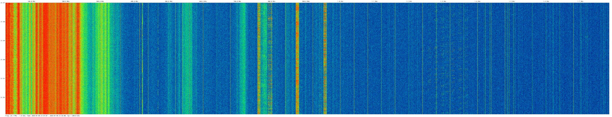

# Radio Surveillance Drone Platform

> **Note:** This project is currently a work in progress. The codebase is actively under development and may undergo
frequent changes before the first stable release. Expect breaking changes, incomplete features, and potential
instability during this period. Please use with caution and report any issues or suggestions to the repository
maintainers.

A Go-based platform for collecting and analyzing radio frequency data using Software Defined Radio (SDR) devices mounted on drones. The system captures RF measurements while recording precise location and telemetry data, enabling spatial RF analysis and signal source mapping.

## Features

- Multi-device support for concurrent data collection from multiple SDRs
- Real-time signal processing and analysis
- Integrated drone telemetry recording
- Efficient data storage using SQLite with per-flight databases
- Synchronized sampling across multiple devices
- Automatic device health monitoring and recovery
- Configurable batch processing and storage

## System Architecture

The system is split into two main components:

1. **Data Collection Tool**
   - Optimized for real-time performance
   - Runs headless on drone's Single Board Computer (SBC)
   - Handles SDR devices, data acquisition, and storage
   - Resource usage optimized for data collection

2. **Visualization Tools** (WIP)
   - Runs on ground stations
   - Implements complex analysis and visualization
   - Can load/compare data from multiple flights
   - Handles advanced signal analysis and mapping

## Getting Started

### Prerequisites

- Go 1.21 or later
- RTL-SDR and/or HackRF tools (`rtl-sdr` / `hackrf` packages, Windows binaries are included)
- SQLite3

### Configuration

The `sweeper` application uses YAML configuration files to define system settings, devices, telemetry, and storage parameters. 
Configuration files are located in the `config/` directory.

#### Configuration Structure

The configuration is divided into four main sections:

```yaml
   settings:
      logLevel: "info"  # Logging verbosity (debug, info, warn, error)
   devices:
      - name: "Device Identifier"
        type: "rtl-sdr"  # or "hackrf"
        enabled: true    # Enable/disable device
        config:          # Device-specific configuration
          frequencyStart: 24000000     # Start frequency in Hz
          frequencyEnd: 1766000000     # End frequency in Hz
          binWidth: 100000             # Frequency bin width
          # Additional device-specific parameters
        buffer:
          capacity: 10     # Maximum sweep sessions to buffer
          flushCount: 3    # Sweep sessions to flush at once
   telemetry:
      serialPort: "/dev/ttyUSB0"  # Telemetry serial port
      baudRate: 115200            # Serial communication speed
      updateInterval: 0.1         # Telemetry update frequency
      enabled: false              # Enable/disable telemetry
      types:                      # Telemetry data types
        - gps
        - imu
        - radio
        - barometer
        - magnetometer
   storage:
      dataDirectory: "data"  # Directory for storing session databases
```
 
#### Example Configuration

A sample configuration (sweeper-fast.yaml) is provided for quick setup, optimized for high-speed drone flights with minimal sweep time (~1-2 seconds).

#### Configuration Tips
- Multiple devices can be configured concurrently
- Devices can be individually enabled/disabled
- Telemetry collection is optional
- Logging level can be adjusted for debugging

#### Usage
Prepare your configuration file
Run the application with the config path:

`./radio-surveillance --config config/sweeper-fast.yaml`

### Heatmap Visualisation Tool

The heatmap tool is a visualization component of the Radio Surveillance Drone Platform designed to generate graphical representations of RF spectrum data collected during drone flights.



#### Command-Line Arguments

```text
Usage: heatmap [options]

Required Arguments:
  -db string       Path to the SQLite database file containing spectrum data
  -o string        Output file path (without extension)
  -s int           Session ID to visualize (default: 1)

Data Filtering Options:
  -min-freq float  Minimum frequency filter in Hz
  -max-freq float  Maximum frequency filter in Hz
  -min-time string Minimum timestamp filter (RFC3339 format)
  -max-time string Maximum timestamp filter (RFC3339 format)

Visualization Options:
  -f string        Output image format [png, jpeg] (default: png)
  -theme string    Color theme for visualization:
                   - classic
                   - grayscale
                   - jungle
                   - thermal
                   - marine

Timezone Option:
  -tz string       Timezone for time display (e.g., 'America/New_York')
```

#### Example Usage

```text
# Basic usage
./heatmap -db flight_data.sqlite -o spectrum_heatmap -s 1

# With frequency filtering
./heatmap -db flight_data.sqlite -o spectrum_heatmap -s 1 \
          -min-freq 100000000 -max-freq 500000000

# With time range and custom timezone
./heatmap -db flight_data.sqlite -o spectrum_heatmap -s 1 \
          -min-time 2023-09-15T10:00:00Z \
          -max-time 2023-09-15T11:00:00Z \
          -tz America/New_York \
          -theme thermal \
          -f jpeg
```

#### Key Features

- Supports multiple output image formats (PNG, JPEG)
- Flexible frequency and time-based data filtering
- Customizable color themes for different visualization styles
- Timezone-aware timestamp rendering
- The tool reads spectrum data from a SQLite database, applies optional filters, and generates a heatmap visualization of RF signal intensity across frequency and time.

## Contributing

Contributions are welcome! Please read our [Contributing Guidelines](CONTRIBUTING.md) first.

## License

This project is licensed under the MIT License - see the [LICENSE](LICENSE) file for details.

## Acknowledgments

- RTL-SDR / HackRF project and contributors
- Go SQLite3 driver maintainers

## Known Issues

- High sample rates may require CPU governor adjustments on SBCs
- GPS accuracy affects signal source location precision
- Multiple SDR devices may cause USB bandwidth issues